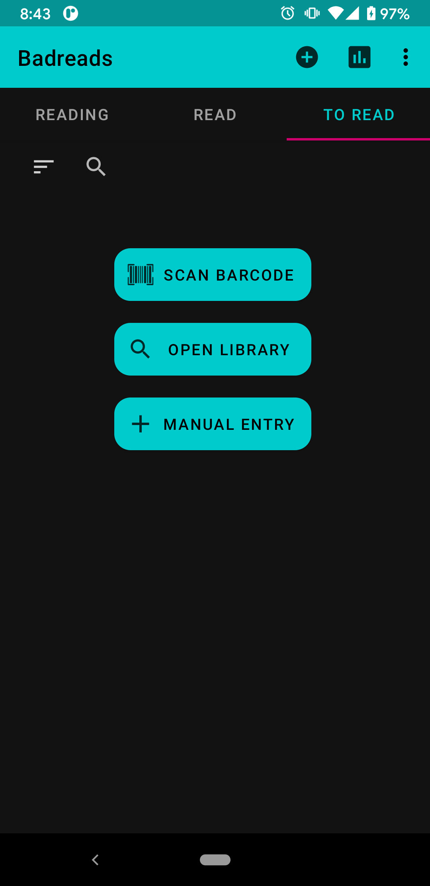
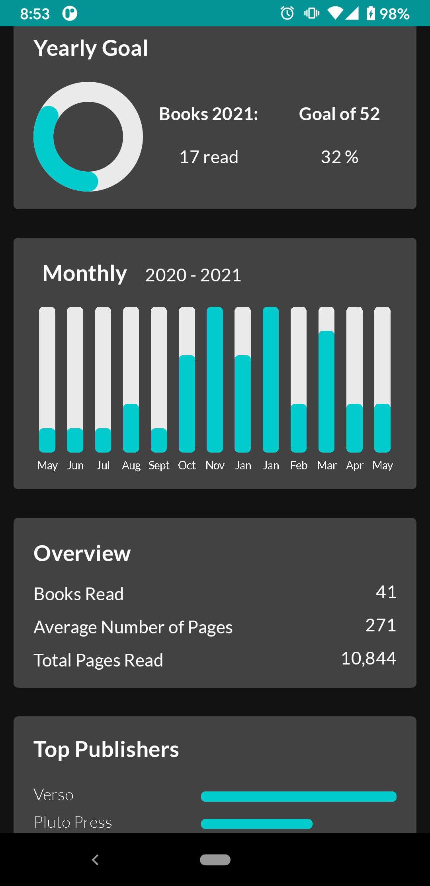

# Badreads

[](https://f-droid.org/packages/com.timenotclocks.bookcase)
[](https://play.google.com/store/apps/details?id=com.timenotclocks.bookcase)


Badreads is a book tracking Android application for logging books
you're reading, read, and want to read. Your library "shelves" (reading, read, and to read)
are stored locally on your phone. Use the search or barcode reader to look up
new book on [OpenLibrary](https://openlibrary.org) and add it to your library. You can
import and export your library from or to Open Library and Goodreads.

Badreads is unstable. I recommend backing up with an export before installing updates or changes.

## Screenshots

 

 

## License

GPLv3
Copyright 2021 Fenimore Love

## Todo:
1. Fix settings action bar color
2. Multiple Authors/DB Relation
5. Include numbers in bar charts
6. Make publishers fuzzy match duplicates in Summary of publishers
10. Batch Scan!
11. Long press the chart to set goal
8. Version 2: Bookshelf view
9. Version 2: Login to OpenLibrary/sync shelves

### Gridlayout example:

```aidl
        List<String> dataSource = new ArrayList<String>();
        GridLayoutManager gridLayoutManager = new GridLayoutManager(this, 3, GridLayoutManager.HORIZONTAL, false);
        recyclerView.setAdapter(new TextRecyclerAdapter(dataSource));
        recyclerView.setLayoutManager(gridLayoutManager);
```

## Known Bugs:

1. When moving export and import to settings, it doesn't succeed in creating new files

## Support Badreads

I hope you enjoy using Badreads for free, ad free, tracking free, and with free software and services.
Please open an issue if you find a bug, think of a feature, or just want to say something!
I apologize in advance if my response or implementation is not prompt! But I'd like to get through everything at some point.

If you'd like to support with money, maybe buy a tasty beverage for the developer, [@fenimore](https://github.com/fenimore),
you can send it with **[PayPal](https://www.paypal.com/paypalme/timenotclocks)** or **Venmo** at `@timenotclocks`, thank you!
