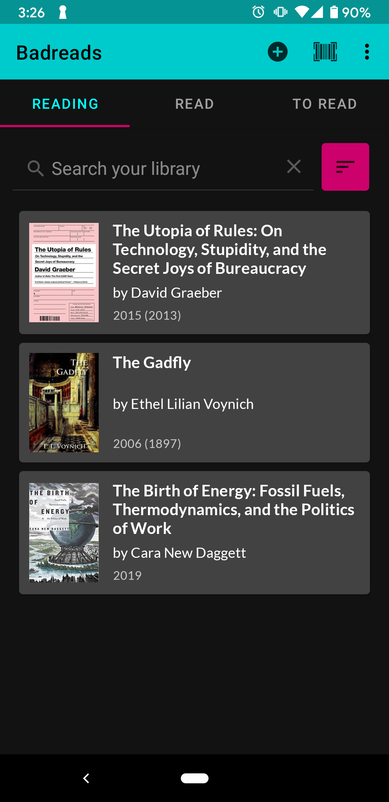
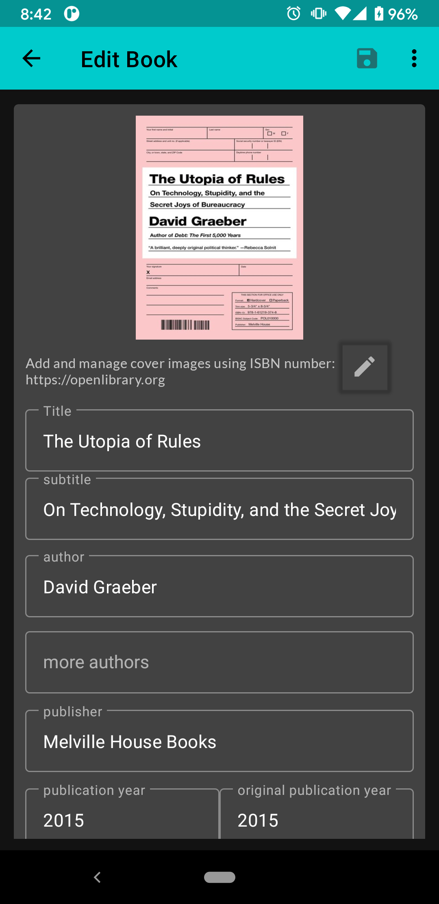

# Badreads

[](https://f-droid.org/packages/com.timenotclocks.bookcase)


Badreads is a book tracking Android application for logging books
you're reading, read, and want to read. Your library "shelves" (reading, read, and to read)
are stored locally on your phone. Use the search or barcode reader to look up
new book on [OpenLibrary](https://openlibrary.org) and add it to your library. You can
import and export your library from or to Open Library and Goodreads.

Badreads is very unstable. I recommend backing up with an export before installing updates or changes.

## Screenshots

 

## License

GPLv3
Copyright 2021 Fenimore Love

## Todo:
1. Fix settings action bar color
2. Empty library prompt
3. Multiple Authors/DB Relation
4. Add tag/star to books
5. Sort a - z and z - a
6. Version 2: Bookshelf view
7. Version 2: Login to OpenLibrary/sync shelves

## Known Bug:

1. Deleting data directly after exporting, and then importing that same csv will break the CSV.
There seems to be an issue with the first line of the "rows" that are written (after the headers).
2. When writing a review, sometimes it doesn't save...
3. When moving export and import to settings, it doesn't succeed in creating new files
4. OpenLibrary doesn't provide descriptions


```aidl
        List<String> dataSource = new ArrayList<String>();
        GridLayoutManager gridLayoutManager = new GridLayoutManager(this, 3, GridLayoutManager.HORIZONTAL, false);
        recyclerView.setAdapter(new TextRecyclerAdapter(dataSource));
        recyclerView.setLayoutManager(gridLayoutManager);
```